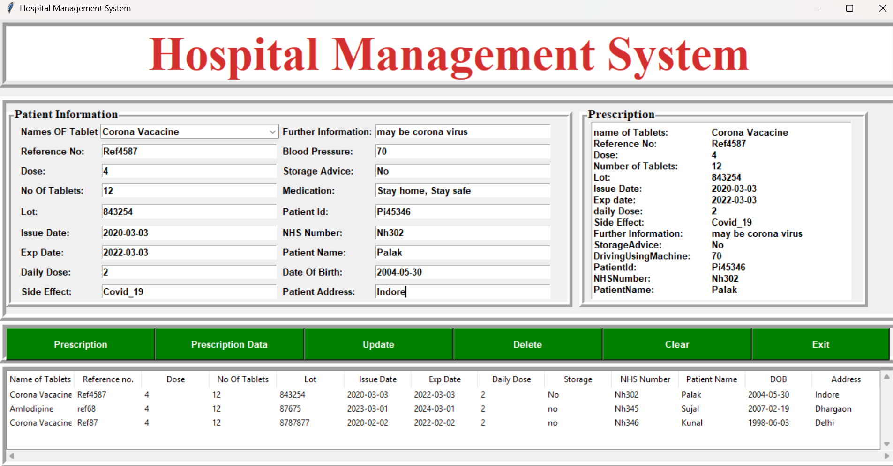

# 🏥 Hospital Management System

A simple desktop app to manage patient records using Python, Tkinter, and MySQL.
The application allows users to input patient data, generate prescriptions, and store everything securely in a MySQL database.

---

## 💻 Technologies Used

- Python 3
- Tkinter (for GUI)
- MySQL
- mysql-connector-python

---

## 📌 Features

- Add patient details and generate prescription
- Save, view, and delete patient records from the database
- Clear the form and safely exit the app

---

## ▶️ Setup Instructions

1. Install package: `pip install mysql-connector-python`
2. Create database: `CREATE DATABASE hospital;`
3. Use database: `USE hospital;`
4. Create table (with all required patient fields):
   -- Table includes name, date of birth, address, side effect, medicines, etc.
5. Add your MySQL credentials (host, user, password, database) in the Python file.

🙋‍♀️ Author
Palak Patidar
GitHub: https://github.com/ppatidar-07

## 🖼 Screenshot

 <!--  -->
